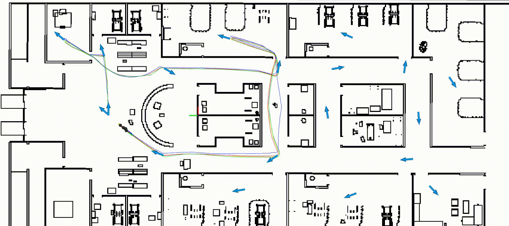
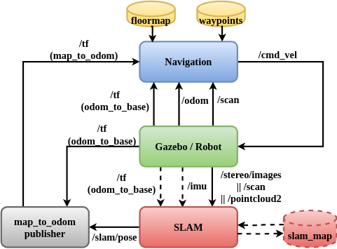

## Task-driven SLAM Benchmarking for Robot Navigation


Task-driven SLAM benchmarking for robot navigation is designed to evaluate **SLAM performance** in the context of **real-world navigation tasks**. In this work, a robot navigation task is defined as a series of waypoints that the robot must visit across multiple trials. The framework assesses SLAM performance based on **Precision**, where a SLAM system achieves the highest Precision if it consistently reaches the same waypoint across trials with minimal variance. The animation illustrates the process of five SLAM methods-*SLAM_Toolbox(2D LiDAR, cyan), GF-GG (Stereo Visual, green), ORB_SLAM3 (Stereo Visual, red), FAST-LIO2(3D LiDAR, yellow), and LIO-SAM(3D LiDAR, blue)*-within a simulated hospital environment in a single trial.

**Real world results are [available](media/results/realworld/README.md).**
**Evaluation scripts can be found [here](scripts/evaluation/closedloop_nav_slam/README.md)**.

## Citation
If you find the benchmarking framework useful, please consider cite our paper:

Du, Y., Feng, S., Cort, C.G. and Vela, P.A. Task-driven SLAM Benchmarking for Robot Navigation. arXiv preprint arXiv:2409.16573, 2024. [Link](https://arxiv.org/abs/2409.16573)

```
@inproceedings{Du2024TaskdrivenSlamBench,
  title={Task-driven SLAM Benchmarking For Robot Navigation},
  author={Yanwei Du and Shiyu Feng and Carlton G. Cort and Patricio A. Vela},
  journal={arXiv preprint arXiv:2409.16573}
  year={2024},
}
```

## System Overview


The framework leverages the [ROS NavStack](https://wiki.ros.org/navigation/Tutorials/RobotSetup) without relying on additional third-party dependencies, aiming to provide the community with a tool for benchmarking SLAM and navigation algorithms in any environment of interest. It offers a portable approach for setting up ground truth measurements in real-world scenarios. For more details, please refer to the [paper](https://arxiv.org/abs/2409.16573).

## Install

They system has been tested on **Ubuntu 20.04** & **ROS Noetic**.

1. Install wstool.
        
        sudo apt-get install python3-rosdep  python3-wstool  build-essential python3-rosinstall-generator python3-rosinstall python3-pip python-is-python3
        pip install rospkg

2. Install ROS packages.

        sudo apt install ros-noetic-navitation               # navigation stack
        sudo apt install ros-noetic-teb-local-planner        # move_base

3. Initialize workspace.

        mkdir -p ~/catkin_ws/src
        cd ~/catkin_ws/src
        
        git clone git@github.com:ivalab/task_driven_slam_benchmarking.git
        # For non-ssh user, please use link: https://github.com/ivalab/task_driven_slam_benchmarking.git

        cd ~/catkin_ws && wstool init src

        wstool merge -t src src/closedloop_nav_slam/turtlebot2.rosinstall

        wstool update -t src -j20
        rosdep install --from-paths src -i -y

4. Build Turtlebot2 Packages.

        cd ~/catkin_ws
        catkin build -j8 -DCMAKE_BUILD_TYPE=Release

5. Build Other ROS Nodes.

        cd ~/catkin_ws
        wstool merge -t src src/closedloop_nav_slam/closedloop_nav_slam.rosinstall
        wstool update -t src -j20
        rosdep install --from-paths src -i -y
        catkin build -j8 -DCMAKE_BUILD_TYPE=Release

6. Build SLAM methods.
Please follow the README of each repo to build the SLAM library in the same ros workspace. (You don't need to build them all, just pick your favorite one.)

   - [SLAM_Toolbox](https://github.com/ivalab/slam_toolbox)
   - [Hector_SLAM](https://github.com/ivalab/hector_slam)
   - [gf_orb_slam2](https://github.com/ivalab/gf_orb_slam2/tree/feature/ubuntu20.04)
   - [ORB_SLAM3](https://github.com/ivalab/ORB_SLAM3/tree/task_driven_benchmark#)
   <!-- - [msckf](https://github.gatech.edu/RoboSLAM/msckf_vio) -->
   - [DSOL](https://github.com/ivalab/dsol/tree/v1.0)
   <!-- - [svo](https://github.gatech.edu/RoboSLAM/rpg_svo_pro_open) -->

## Run Real World Test
[RealWorldTest](RealWorldTest.md)


## Run Gazebo Simulation


**!!! Please source ros workspace in each terminal.!!!**
    
    source ~/catkin_ws/devel/setup.bash

1. Set map and robot init pose. The map and robot_init_pose are recorded [here](configs/map//README.md).
   1. Set them in the gazebo launch file.
        
        [launch/gazebo/gazebo_turtlebot.launch](launch/gazebo//gazebo_turtlebot.launch)

   2. Set them in the config file.
   
        [configs/params/config.yaml](configs/params/config.yaml)

2. Start launch files.
```bash
# Start roscore.
roscore

# Start gazebo, default w/o vlp16. To enable gazebo gui add "gui:=true"
roslaunch closedloop_nav_slam gazebo_turtlebot.launch
# Use the following with vlp16.
# roslaunch closedloop_nav_slam gazebo_turtlebot.launch laser_type:=vlp16

# Run onekey testing script.
roscd closedloop_nav_slam
cd scripts/nodes/
python onekey.py
# The results are saved to the directory defined in config.yaml.

# Start rviz.
roscd closedloop_nav_slam
cd launch
rviz -d closedloop_viz.rviz

# Generally, the script ends smoothly after the testing is done.
# If the script fails for any reason and cannot be terminated, please use 
# the kill_onekey_script.sh to shut it down.
cd scripts/nodes/tools/
```
[`./kill_onekey_script.sh`](scripts/tools/kill_onekey_script.sh)

#### Parameters Tuning

1. The main config file [`config.yaml`](configs/params/config.yaml).
It mainly defines the running parameters, ros topics, env name, slam_methods names, e.t.c.

2. Navgition parameters [`nav`](configs/params/nav/)

3. SLAM parameters [`slam`](configs/params/slam/)

4. Map files [`map`](configs/map/)

5. Path files [`path`](configs/path/)


---
## Customize to other methods
#### Steps to add a new SLAM method
1. Define a new class named `${SLAM_NAME}Node` in [`slam_module.py`](scripts/closedloop_nav_slam/utils/slam_module.py). Here is an example of adding `amcl`:

```python
    class AmclNode(NodeBase):
    def __init__(self, params: Dict):
        # Define the rosnode names when launching amcl, including amcl and other accessory nodes that amcl requires.
        names = ["amcl", "slam_map_server"]
        super().__init__(names, params)

    def compose_start_cmd(self) -> str:
        # Defines the ros command to start amcl.
        return (
            "roslaunch closedloop_nav_slam amcl.launch output_pose_topic:="
            + self._params["et_pose_topic"]
        )
```
2. Add the new method to factory class in [`slam_module.py`](scripts/closedloop_nav_slam/modular/slam_module.py). It simply maps the `slam_method_name` to the `slam_node` class.
```python
def CreateSlamNode(params: Dict) -> NodeBase:
    ...
```

3. Add slam parameters in [`{SLAM_NAME.yaml}`](configs/params/slam/). For example:
```yaml
## amcl
slam_method: "amcl"
mode: "localization"
enable_msf: false
slam_sensor_type: "laser"
source_msg_parent_frame: "base_footprint" # Define the parent frame that aligns with map frame in slam. VSLAM typically is left_camera_frame, 2D laser is base_footprint.
source_msg_child_frame: "gyro_link" # Define the child frame of which the pose is estimated in parent frame. VSLAM typically is left_camera_optical_frame, 2D laser is base_footprint.
loops: 1 # Define the number of loops in a single trial.
need_map_to_odom_tf: false # Whether needs an additional map_to_odom_tf publisher node. Most 2D laser methods in ros publish this tf inside their class. Some do not and need this publisher node.
```

#### Steps to Manually Extract/Define Waypoints From A Known Map.

1. Set the map in launch file [`map.launch`](launch/realworld/map.launch)

2. Launch tools to select waypoints.
```bash
# First set the proper map file in the launch file.
roslaunch closedloop_nav_slam map.launch

# Start waypoints saver
rosrun closedloop_nav_slam waypoints_saver.py

# Start rviz and select 2D nav goal.
rviz -d launch/closedloop_viz.rviz

# The waypoints will be saved under `scripts/closedloop_nav_slam/ros/` and can later be moved to `configs/path/`
```
