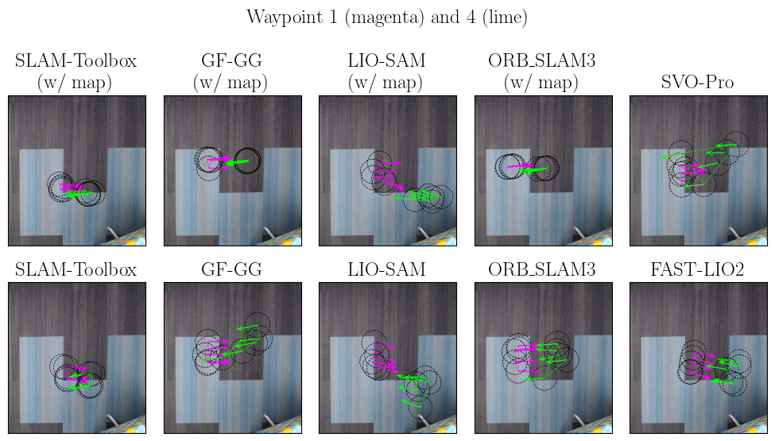

# Real World Result

### Experiment
The real world experiment is conducted in an office environment, where the path includes a long corridor. The robot starts from a fixed point, visits six waypoints sequentially, and then returns to the starting location, completing a single round trip.

### Result

- **Robot Locations Captured by Overhead Cameras at Waypoints**

  The following figures presents robot performance with SLAM methods at six waypotins (rendered by different colors), captured by three overhead cameras respectively.
  Black circles are robot actual locations at each waypoint, with  arrows represent orientations. The repeated rounds for a single waypoint are grouped in polygons.

  The following animation demonstrates the robot entering and exiting the one of the overhead cameras' field of view (FOV) during the testing.

