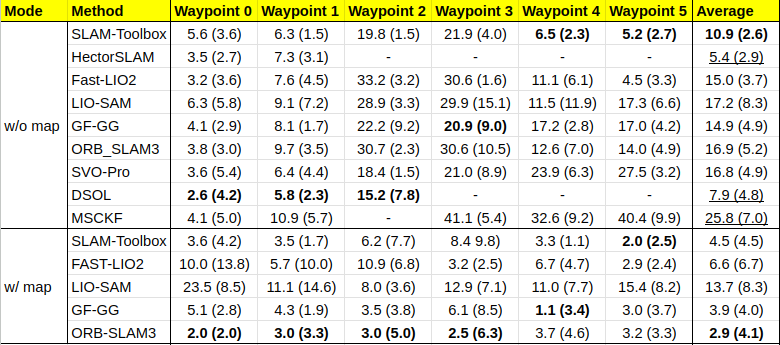
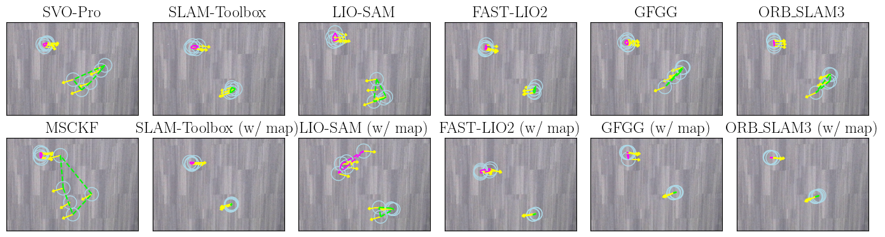
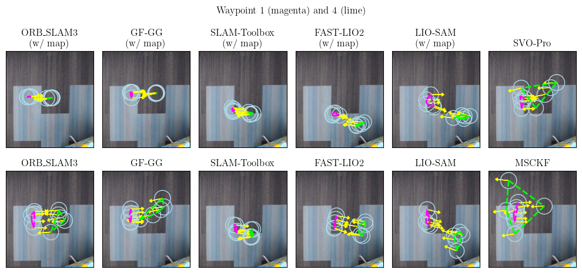
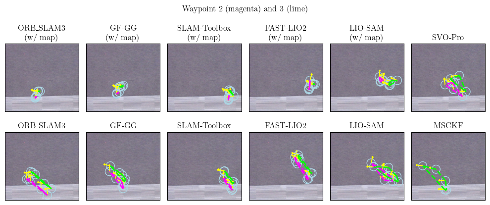

# Real World Result

### Experiment
The real world experiment is conducted in an office environment, where the path includes a long corridor. The robot starts from a fixed point, visits six waypoints sequentially, and then returns to the starting location, completing a single round trip.

### Result
- **Table I: Precision of Waypoint Position (Orientation) (Units: cm / degrees)**
  - The best values (the smaller, the better) are in **bold**.
  - Methods **without** full completeness are <ins>underlined</ins>.

- **Robot Locations Captured by Overhead Cameras at Waypoints**

1. The figures presents robot performance with SLAM methods at six waypotins (rendered by different colors), captured by three overhead cameras respectively.
Blue circles are robot positions at this waypoint, with yellow arrows represent orientations. The repeated rounds for a single waypoint are grouped in polygons.

2. The following animation demonstrates the robot entering and exiting the overhead camera's field of view (FOV) during the testing.

